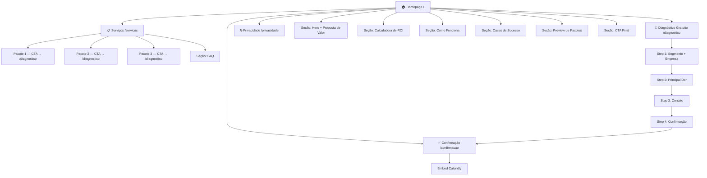
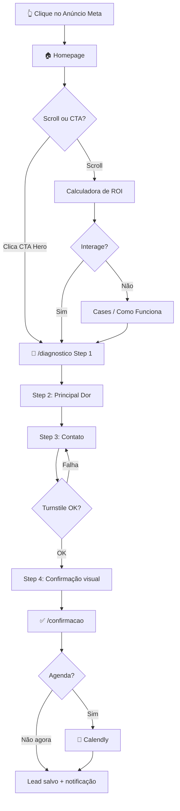
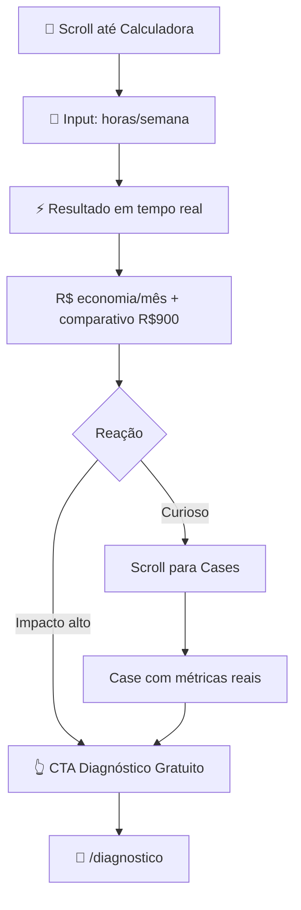
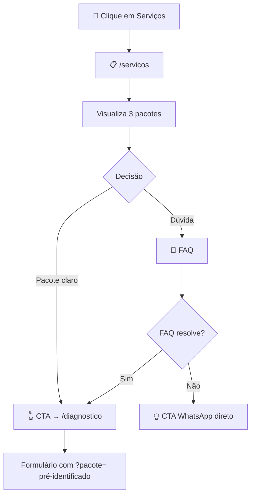

# Luno Automações — UI/UX Specification

**Data:** 2026-03-21
**Versão:** 1.0
**Status:** Ready for Development
**Autor:** Uma (@ux-design-expert)

---

## Introduction

Este documento define os objetivos de experiência do usuário, arquitetura de informação, fluxos de usuário e especificações de design visual para a interface da **Luno Automações**. Serve como fundação para o design visual e desenvolvimento frontend, garantindo uma experiência coesa e centrada no usuário.

### Overall UX Goals & Principles

#### Target User Personas

**Persona 1 — Gestora de Clínica (Decisora)**
Mulher, 35-50 anos, dona ou gestora de clínica médica/odontológica/estética com 2-20 funcionários. Usa WhatsApp intensamente, tem Instagram pessoal, mas não é tech-savvy. Toma decisões baseada em confiança e prova social. Acessa o site via celular após ver anúncio no Instagram. Principal dor: perde pacientes por falha no retorno e confirmação de consultas.

**Persona 2 — Gestor Operacional (Influenciador)**
Homem ou mulher, 28-40 anos, coordenador de operações em clínica maior (10-50 funcionários). Já pesquisou Zapier/Make mas não teve tempo de implementar. Acessa o site via desktop. Principal dor: processos manuais entre recepção, financeiro e prontuário que geram retrabalho.

#### Usability Goals

- **Clareza imediata:** visitante entende o que a Luno faz em menos de 10 segundos sem scroll
- **Confiança progressiva:** cada seção remove uma objeção de compra antes de pedir o contato
- **Conversão sem fricção:** CTA de diagnóstico gratuito acessível em qualquer ponto da página
- **Mobile-first real:** 100% funcional em tela de 375px — formulário, calculadora e Calendly
- **Resposta imediata:** feedback visual instantâneo em interações (calculadora, formulário)

#### Design Principles

1. **Clareza antes de estética** — linguagem de negócio, não técnica. O visitante deve entender antes de admirar
2. **Conversão pelo exemplo** — o site demonstra automação funcionando, não apenas descreve
3. **Confiança construída em camadas** — cada scroll adiciona uma razão para confiar
4. **Vibrante mas profissional** — paleta clara e energética que transmite modernidade sem intimidar
5. **Acessível por padrão** — WCAG AA desde a primeira linha de código

### Change Log

| Data | Versão | Descrição | Autor |
|------|--------|-----------|-------|
| 2026-03-21 | 1.0 | Versão inicial | Uma (@ux-design-expert) |

---

## Information Architecture

### Site Map / Screen Inventory



### Navigation Structure

**Primary Navigation (Header):**
Logo Luno Automações (esquerda) + 2 links máximo: "Serviços" + botão CTA "Diagnóstico Gratuito" (direita). Nav minimalista — sem dropdown. Em mobile: logo + botão CTA apenas.

**Secondary Navigation:** Nenhuma. Toda navegação acontece via scroll e CTAs internos.

**Footer:** Logo + tagline + links: "Serviços", "Privacidade" + ícones Instagram/Facebook + e-mail.

**Breadcrumb Strategy:** Não aplicável — estrutura plana (máx. 1 nível de profundidade).

---

## User Flows

### Flow 1 — Conversão Principal (Meta Ad → Agendamento)

**User Goal:** Gestor de clínica descobre a Luno via anúncio e agenda diagnóstico gratuito
**Entry Points:** Anúncio Facebook/Instagram → Homepage
**Success Criteria:** Lead completa o formulário e clica no Calendly na página de confirmação



**Edge Cases:**
- Turnstile falha → mensagem amigável + sugerir WhatsApp direto
- Rate limit atingido → "Já recebemos seu contato! Aguarde nosso retorno."
- Make.com indisponível → fallback Resend garante notificação
- Abandono no formulário → dados não persistidos (sem tracking de formulário no MVP)

---

### Flow 2 — Calculadora de ROI (Engajamento → Intenção)

**User Goal:** Visitante quantifica o custo do trabalho manual e decide buscar solução
**Entry Points:** Scroll na homepage até seção da calculadora
**Success Criteria:** Visitante interage e clica no CTA de diagnóstico



**Edge Cases:**
- Input zero → resultado zerado com mensagem neutra
- Input >100h → cap com nota "Fale com a gente para casos complexos"
- Mobile: slider em vez de campo numérico

---

### Flow 3 — Serviços → Diagnóstico

**User Goal:** Visitante entende pacotes e preços antes de qualquer contato
**Entry Points:** Link "Serviços" no header ou preview na homepage
**Success Criteria:** Visitante escolhe pacote e clica no CTA



**Notes:** Formulário recebe query param `?pacote=nome` para pré-identificar interesse do lead.

---

## Wireframes & Key Screen Layouts

**Primary Design Files:** A definir — iniciar desenvolvimento direto com shadcn/ui.

### Homepage `/`

**Purpose:** Converter visitante frio em lead qualificado via scroll progressivo de confiança

```
┌─────────────────────────────────────────┐
│ HEADER (sticky)                         │
│ [Logo Luno]    [Serviços] [CTA ▶]       │
├─────────────────────────────────────────┤
│ HERO (100vh mobile)                     │
│  A geração imediatista não espera.      │
│  Sua operação também não deveria.       │
│  [Subheadline para clínicas]            │
│  [🟣 Quero meu diagnóstico gratuito]    │
│  [Logos: Make · n8n · Zapier · Google]  │
├─────────────────────────────────────────┤
│ CALCULADORA DE ROI                      │
│  [Slider: X horas/semana]               │
│  [Resultado: R$__/mês → vs R$900]       │
│  [CTA: Automatizar agora]               │
├─────────────────────────────────────────┤
│ COMO FUNCIONA (3 cards)                 │
│  [1. Diagnóstico][2. Proposta][3. Entrega] │
├─────────────────────────────────────────┤
│ CASES DE SUCESSO                        │
│  [Card Clínica] [Card Academia]         │
├─────────────────────────────────────────┤
│ PREVIEW PACOTES + [Ver todos →]         │
├─────────────────────────────────────────┤
│ CTA FINAL                               │
│  [🟣 Diagnóstico gratuito — sem custo]  │
├─────────────────────────────────────────┤
│ FOOTER                                  │
└─────────────────────────────────────────┘
```

**Interaction Notes:** Calculadora atualiza em tempo real. Sticky CTA no mobile (barra inferior após 300px de scroll).

---

### Serviços `/servicos`

**Purpose:** Apresentar pacotes com clareza para decisão sem call de vendas

```
┌─────────────────────────────────────────┐
│ HEADER                                  │
├─────────────────────────────────────────┤
│ HERO PEQUENO: "Escolha como automatizar"│
├─────────────────────────────────────────┤
│ 3 PACOTES (grid)                        │
│ ┌──────┐ ┌──────────────┐ ┌──────┐     │
│ │Piloto│ │  Automático  │ │Turbo │     │
│ │      │ │[MAIS POPULAR]│ │      │     │
│ │R$X   │ │   R$900      │ │R$X   │     │
│ │[CTA] │ │   [CTA]      │ │[CTA] │     │
│ └──────┘ └──────────────┘ └──────┘     │
├─────────────────────────────────────────┤
│ FAQ (accordion)                         │
│  ▸ É caro?  ▸ Preciso de TI?           │
│  ▸ Quanto tempo leva?  ▸ E se falhar?  │
├─────────────────────────────────────────┤
│ CTA FINAL + FOOTER                      │
└─────────────────────────────────────────┘
```

---

### Formulário de Diagnóstico `/diagnostico`

**Purpose:** Coletar dados do lead com mínima fricção em 4 etapas progressivas

```
┌─────────────────────────────────────────┐
│ HEADER simplificado                     │
│ PROGRESS BAR: ●●○○                      │
├─────────────────────────────────────────┤
│ STEP 1: "Qual é o seu segmento?"        │
│  [🏥 Clínica][🏋️ Academia][🛒 E-com][Outro] │
│  "Nome da empresa" [____________]       │
│                    [Próximo →]          │
├ ─ ─ ─ ─ ─ ─ ─ ─ ─ ─ ─ ─ ─ ─ ─ ─ ─ ─ ┤
│ STEP 2: "O que mais toma seu tempo?"    │
│  [Agendamentos][Cobranças][Atendimento] │
│  [← Voltar]            [Próximo →]     │
├ ─ ─ ─ ─ ─ ─ ─ ─ ─ ─ ─ ─ ─ ─ ─ ─ ─ ─ ┤
│ STEP 3: Contato                         │
│  "Como posso te chamar?" [__________]  │
│  "WhatsApp ou e-mail"    [__________]  │
│  [Turnstile]                            │
│  [← Voltar]              [Enviar ✓]    │
├ ─ ─ ─ ─ ─ ─ ─ ─ ─ ─ ─ ─ ─ ─ ─ ─ ─ ─ ┤
│ STEP 4: ✅ "Recebemos seu diagnóstico!" │
│  "Redirecionando em 3s..."              │
└─────────────────────────────────────────┘
```

**Interaction Notes:** Steps 1-2: seleção por card (touch-friendly). Header simplificado sem navegação para reduzir saídas.

---

### Confirmação `/confirmacao`

**Purpose:** Fechar ciclo do lead com agendamento imediato via Calendly

```
┌─────────────────────────────────────────┐
│ HEADER simplificado                     │
├─────────────────────────────────────────┤
│  ✅ "Boa, [Nome]! Recebi seu diagnóstico."│
│  "Agende nossa conversa:"               │
│  ┌─────────────────────────────────┐    │
│  │       EMBED CALENDLY (inline)   │    │
│  └─────────────────────────────────┘    │
│  "Prefere pelo WhatsApp?"               │
│  [💬 Chamar no WhatsApp]                │
├─────────────────────────────────────────┤
│ FOOTER mínimo                           │
└─────────────────────────────────────────┘
```

---

## Component Library / Design System

**Design System Approach:** shadcn/ui como base + tokens customizados da Luno Automações. Atomic Design como metodologia de organização.

### Button (Atom)
**Purpose:** CTA principal, ações secundárias e links de navegação
**Variants:** `primary`, `secondary`, `ghost`, `whatsapp`
**States:** default, hover, focus (ring visível WCAG AA), loading, disabled
**Usage Guidelines:** Texto imperativo. Tamanho mínimo touch 44×44px. Nunca `disabled` sem tooltip.

### Input (Atom)
**Purpose:** Campos de texto no Step 3 do formulário
**Variants:** `default`, `error`, `success`
**States:** empty, focused, filled, error, success
**Usage Guidelines:** Label sempre visível. Erro abaixo do campo. Auto-complete habilitado.

### Card (Atom/Molecule)
**Purpose:** Pacotes, cases, steps "Como funciona"
**Variants:** `service`, `case`, `step`, `featured`
**States:** default, hover (elevação), selected (borda de acento)
**Usage Guidelines:** Máx. 3 por linha desktop, 1 em mobile. `featured` sempre centralizado.

### FormStepper (Organism)
**Purpose:** Container do formulário multi-step
**States:** step ativo, completo (check), futuro (inativo)
**Usage Guidelines:** Progress bar sempre visível. "Voltar" sempre disponível exceto Step 1. Nunca perder dados ao voltar.

### ROICalculator (Organism)
**Purpose:** Calculadora interativa de economia mensal
**Variants:** `slider` (mobile), `input` (desktop)
**States:** empty, interacting, result
**Usage Guidelines:** Resultado em tempo real com debounce 300ms. Animação count-up. CTA aparece com o resultado.

### CookieBanner (Organism)
**Purpose:** Consentimento LGPD para Meta Pixel
**Variants:** `compact` (mobile), `standard` (desktop)
**States:** visible, accepted, rejected
**Usage Guidelines:** Não bloquear conteúdo. Botões: "Aceitar" (primário) + "Recusar" (ghost). Preferência em localStorage.

### Badge (Atom)
**Purpose:** Destaque visual em cards
**Variants:** `featured`, `category`, `metric`
**Usage Guidelines:** Máx. 1 badge por card. Texto ≤ 2 palavras.

---

## Branding & Style Guide

### Color Palette

| Color Type | Hex | Tailwind Token | Uso |
|------------|-----|----------------|-----|
| Background | `#FAFAFA` | `bg-neutral-50` | Fundo base |
| Surface | `#FFFFFF` | `bg-white` | Cards, formulários |
| Primary | `#7C3AED` | `bg-violet-600` | CTA, links, destaques |
| Primary Hover | `#6D28D9` | `bg-violet-700` | Hover de CTAs |
| Primary Light | `#EDE9FE` | `bg-violet-100` | Backgrounds de destaque |
| Accent | `#06B6D4` | `bg-cyan-500` | Métricas, badges de resultado |
| Success | `#10B981` | `bg-emerald-500` | Confirmações, WhatsApp badge |
| Warning | `#F59E0B` | `bg-amber-400` | Avisos |
| Error | `#EF4444` | `bg-red-500` | Erros de validação |
| Text Primary | `#111827` | `text-gray-900` | Headings, texto principal |
| Text Secondary | `#6B7280` | `text-gray-500` | Subtextos, labels |
| Border | `#E5E7EB` | `border-gray-200` | Bordas de cards e inputs |

> ⚠️ `#06B6D4` (ciano): usar APENAS em métricas grandes (≥24px) ou elementos gráficos — contraste 3.0:1 insuficiente para texto corrido.

### Typography

**Font Families:**
- **Primary:** Inter (via `next/font/google`)
- **Monospace:** JetBrains Mono — apenas valores numéricos da calculadora

**Type Scale:**

| Element | Size | Weight | Line Height |
|---------|------|--------|-------------|
| H1 | 3rem / 48px | 800 | 1.15 |
| H2 | 2rem / 32px | 700 | 1.25 |
| H3 | 1.5rem / 24px | 600 | 1.35 |
| H4 | 1.125rem / 18px | 600 | 1.4 |
| Body | 1rem / 16px | 400 | 1.6 |
| Small | 0.875rem / 14px | 400 | 1.5 |
| Metric | 2.5rem / 40px | 700 | 1.0 |

Mobile: H1 → 2rem, H2 → 1.5rem.

### Iconography
**Icon Library:** `lucide-react` — MIT license, tree-shakeable, integra com shadcn/ui
**Sizes:** 20px inline, 24px botões, 32px cards de destaque
**Usage:** Sempre acompanhar com texto. Emojis apenas no Step 1 do formulário (contexto lúdico).

### Spacing & Layout

**Container:** máx. 1280px centralizado, padding `1.5rem` mobile / `2rem` desktop

**Spacing Scale:**

| Token | Value | Tailwind |
|-------|-------|----------|
| xs | 4px | p-1 |
| sm | 8px | p-2 |
| md | 16px | p-4 |
| lg | 24px | p-6 |
| xl | 48px | p-12 |
| 2xl | 80px | py-20 |

**Border Radius:** Botões `rounded-lg`, Cards `rounded-xl`, Inputs `rounded-md`, Badges `rounded-full`

---

## Accessibility Requirements

**Standard:** WCAG 2.1 AA — Lighthouse Accessibility ≥ 90

### Key Requirements

**Visual:**
- Contraste mínimo 4.5:1 texto normal, 3:1 texto grande
- `#111827` sobre `#FAFAFA` = 16.75:1 ✅
- `#FFFFFF` sobre `#7C3AED` = 5.94:1 ✅
- Focus indicator: `ring-2 ring-violet-600 ring-offset-2` em todos os elementos interativos

**Interaction:**
- Tab order lógico seguindo ordem visual do DOM
- `aria-live="polite"` no resultado da calculadora
- `role="progressbar"` com `aria-valuenow` na barra de progresso
- Touch targets mínimo 44×44px

**Content:**
- Imagens decorativas: `alt=""`
- Heading structure: H1 único por página, hierarquia estrita
- `<label>` explícito com `for` para cada input

### Testing Strategy
- `eslint-plugin-jsx-a11y` desde Story 1.1
- Lighthouse CI no deploy (bloqueia se < 90)
- `@axe-core/react` em desenvolvimento
- Testes manuais pré-lançamento: VoiceOver (iOS Safari), NVDA (Windows Chrome), zoom 200%

---

## Responsiveness Strategy

### Breakpoints

| Breakpoint | Min Width | Max Width | Devices |
|------------|-----------|-----------|---------|
| Mobile | 375px | 767px | iPhone SE → Android médio |
| Tablet | 768px | 1023px | iPad, tablets |
| Desktop | 1024px | 1279px | Laptops |
| Wide | 1280px | — | Monitores grandes |

### Adaptation Patterns

| Elemento | Mobile | Desktop |
|----------|--------|---------|
| Grid pacotes | 1 coluna | 3 colunas |
| Grid "Como funciona" | 1 coluna | 3 colunas |
| Hero headline | 2rem | 3rem |
| Calculadora | Slider full-width | Slider + resultado lado a lado |
| Cases | 1 card (scroll) | 2 colunas |
| Header | Logo + CTA apenas | Logo + Serviços + CTA |
| CTA sticky | Barra inferior fixa | Não |

**Hover states:** `@media (hover: hover)` — desabilitados em touch devices.

---

## Animation & Micro-interactions

### Motion Principles
1. Propósito antes de estética — toda animação comunica estado
2. Velocidade imediatista — durations 150-300ms
3. Respeitar `prefers-reduced-motion` — fade instantâneo como fallback
4. Performance first — apenas `transform` e `opacity` animados

### Key Animations

| Animação | Duration | Easing | Trigger |
|----------|----------|--------|---------|
| ROI Count-up | 600ms | ease-out | Input change (debounce 300ms) |
| Form Step Transition | 250ms | ease-in-out | Clique "Próximo" |
| CTA Button Pulse | 800ms (1x) | ease-in-out | Idle 3s |
| Success Checkmark | 500ms | ease-out | Submissão bem-sucedida |
| Sticky CTA Slide-up | 200ms | ease-out | Scroll > 300px |
| Card Hover Elevation | 150ms | ease-out | mouseenter (desktop only) |
| FAQ Accordion | 200ms | ease-in-out | click/tap |
| Cookie Banner Slide-in | 300ms (delay 1.5s) | ease-out | Page load |

---

## Performance Considerations

### Performance Goals
- **LCP:** < 2.5s em 4G
- **INP:** < 200ms
- **Animation FPS:** 60fps constante
- **Lighthouse:** Performance ≥ 90, Accessibility ≥ 90, SEO ≥ 90, Best Practices ≥ 90

### Design Strategies

**Imagens:** WebP + fallback JPEG via `<picture>`. `next/image` com `sizes` corretos. Logos SVG inline.

**Fontes:** `next/font` com `display: swap`. Preload apenas variantes usadas (Inter 400/600/700/800). JetBrains Mono via dynamic import apenas quando calculadora está no viewport.

**JavaScript:**
- Calendly: `strategy="lazyOnload"` apenas em `/confirmacao`
- Meta Pixel: `strategy="afterInteractive"` apenas após consentimento LGPD
- ROI Calculator: JS puro ~2KB, sem biblioteca externa

**CSS:** Tailwind PurgeCSS automático — bundle < 20KB. CSS variables para tokens.

**Critical Path:** Hero visível sem JavaScript (SSG/SSR). CTA funcional como link `<a>` sem JS.

---

## Next Steps

### Immediate Actions

1. Definir identidade visual final — logo, paleta confirmada, tokens no Tailwind config
2. Validar contraste da paleta com ferramenta (Coolors ou Figma A11y plugin)
3. Acionar `@devops *environment-bootstrap` — inicializar git, GitHub remote e CI/CD
4. Iniciar Story 1.1 com `eslint-plugin-jsx-a11y` e Sentry desde o primeiro commit
5. Criar projeto no Figma (opcional) ou iniciar direto no código com shadcn/ui

### Design Handoff Checklist

- [x] Todos os user flows documentados (3 flows com diagramas Mermaid)
- [x] Inventário de componentes completo (7 componentes core)
- [x] Requisitos de acessibilidade definidos (WCAG AA + testing strategy)
- [x] Estratégia responsiva clara (4 breakpoints + adaptation patterns)
- [x] Brand guidelines incorporadas (paleta, tipografia, spacing, iconografia)
- [x] Performance goals estabelecidos (LCP < 2.5s, INP < 200ms, Lighthouse ≥ 90)

---

*Uma (@ux-design-expert) · Synkra AIOX · 2026-03-21*
